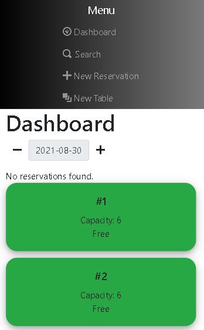

# H1 Restaurant Reservation Application

A restaurant table reservation and seating application that allows an employee to take reservations at appropraite times and seat guests at the perfect table.

Click [this]() to see the application in action!

# H3 Dashboard
The dashboard allows you to view the current tables and their status. It will also display all reservations (depending on date).

# H3 Create Tables
Allows user to create new tables and add available capacity to new tables.

# H3 Create Reservation 
Allows user to create a brand new reservation for present and future times.

# H3 Search for reservation
User is able to look up any reservation stored in the database by reservation phone number.

# H2 Stack/Tech
--------------------------------------------------------
    * React: for UI rendering (Front-End).
    * React Router - client-side routing through the application.
    * Node.js: Back-End.
    * CSS and bootstrap for styling.
    * Express - framework for building application's API.
    * PostgreSQL: SQL database for storing and retrieving application data.
    * Deployed with Vercel.

!    